# CS4243 Lab 1 reference implementation report

## Gabor Implementation

When correlated with an image, a Gabor filter extracts the patterns in the image that match it. In this part we implement a Gabor filter bank, combining Gabor filters of various orientations, frequencies, and phases. The energy is then computed from the response of these filters, and pooled in order to increase the stability of the responses.

### Implementation
We implement the `make_gabor_bank` function which takes in a configuration object indicating the phases, orientations and frequencies of the Gabor filters to be added to the bank. The filters are then created in a deterministic order, iterating over frequencies first, then orientations the phases. The function returns these filters in the form of 2D numpy arrays, where each cell is the value of the 2D Gabor filter at those coordinates. The metadata for each filter is also conserved and returned by the function.

Next we want to be able to correlate these filters with an image and compute the response energy maps for each filter. To do this we implement the `gabor_energy_maps` function. This function correlates each map in a given Gabor filter bank with the image, computes the energy (either the squared response or the absolute response depending on `energy` parameter), and then mean pools these energies with `poolsize` given as an argument.

### Question 1 : How do frequency, orientation, phases, and pooling size change the response maps? 

<!-- TODO Complete this explanation with more examples, pictures etc. -->
**Frequency impact**
A higher frequency means the filter reponds to stripes that are closer together. By combining filters of different frequencies we can detect differently spread out stripes. The below figure shows this on a synthetic example. Notice how a gabor filter of a certain frequency only matches lines with the same frequency.
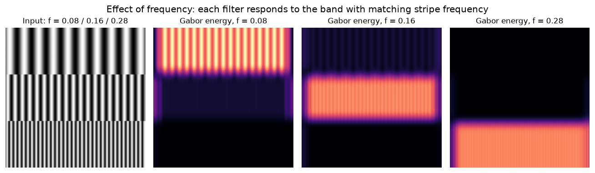

**Orientation Impact**
Orientation changes which direction the pattern has to be for it to cause a high response. For example an orientation of 0 means the filter responds highly to completely vertical lines, whereas an orientation of $\frac{\pi}{2}$ means the filter responds to completely horizontal lines. The synthetic example below shows this in action : the Gabor filters only match the patterns with the correct orientation.

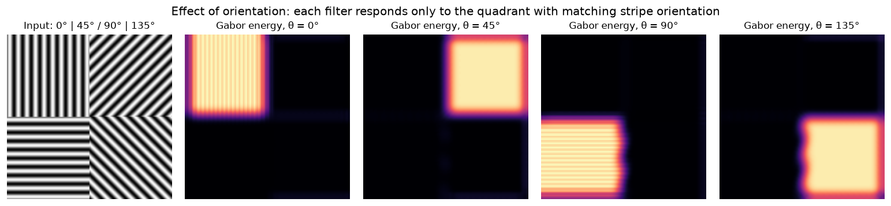

**Phase impact**

Phase shifts the sinusoidal stripes inside the fixed Gaussian envelope without altering their spacing or orientation. When the phase offset is $\frac{\pi}{2}$ (or $\frac{3\pi}{2}$), the filter is **antisymmetric** (odd-symmetric) and acts as an edge detector, responding most strongly to sharp light-to-dark transitions. Conversely, when the phase is $0$ (or $\pi$), the filter is **symmetric** (even-symmetric) and acts as a ridge/stripe detector, responding strongest to line structures.

The synthetic example below illustrates this behavior as both symmetric and antisymmetric filters process a uniform band and a sharp step edge. The antisymmetric filter produces dual peak responses aligned with the boundaries, whereas the symmetric filter produces a single peak centered directly over the band itself.

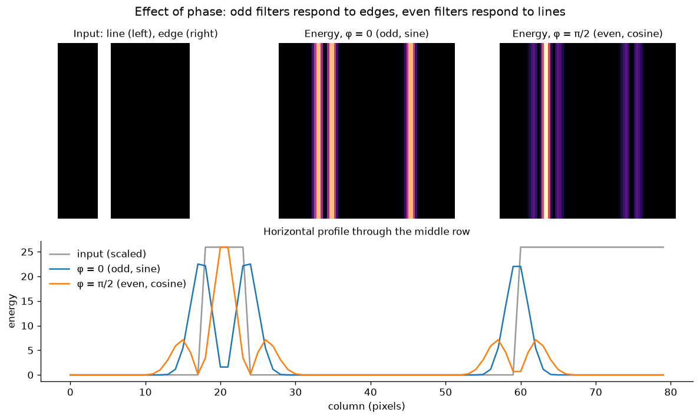

**Pooling size impact**

Pooling size affects the size of the regions we are considering. With a small pooling size, we look at more local responses. This means that even if we have a pattern that matches our filter (for example the stripes in the wood), if the pooling size is smaller than a period then there will still be peaks and throughs leading to an unstable response. What we want is for responses in homogenous regions (same texture) to be constant. A larger pooling size allows us to smoother over these small variations, in particular if we choose a pooling size that is bigger than the wavelength of the filter. Then peaks and throughs due to the filter cancel out in the avarge. The risk however, is to smooth over important details that are smaller than the pooling size.

For example if we look at a train wood image, which has no defects. We expect a relatively smooth response as the pattern repeats with perhaps some mild variations due to the way the frequency of the stripes change in the wood. The below figure shows the result of varying the pooling size from 3 to 21 when applying a vertical gabor filter that matches the stripes of the wood. With pooling size 3 we notice stripes in the responses of this vertical filter due to the filter's peaks and throughs. With a larger pooling size these cancel out leaving only the pattern response.

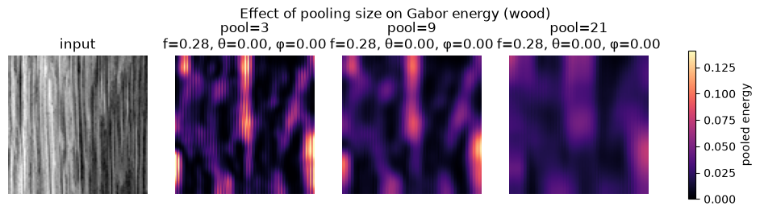

However this next figure shows what happens if we have a small detail we would like to preserve. In this case we choose an image of wood with a defect (holes) and apply a vertical gabor filter. When pooling becomes too large the peaks in response caused by the smaller holes get smoothed over and confounded with the background texture response.

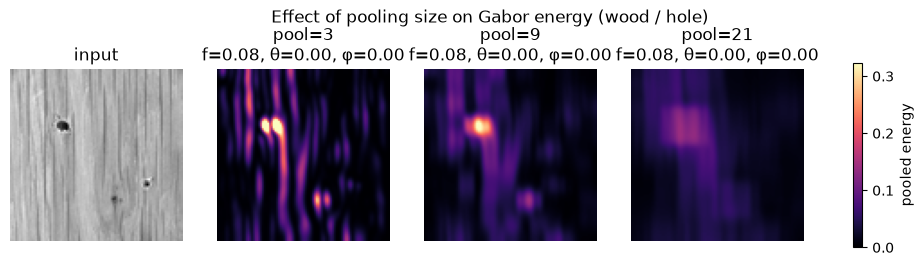

## Edge Implementation

In order to find the edges we implement Canny edge detection. This involves the 4 steps below :

1. Gaussian Smoothing
2. Gradients magnitudes and orientations computation
3. Non maximum suppression 
4. Hysteresis thresholding

The main pipeline is executed in the `detect_edges` function which computes the nescessary steps. For Gaussian smoothing and gradient magnitude and orientation computation, we used the supplied `gaussian_smoothing`, and `sobel_gradients` functions respectively.

After gradient computation the gradient magnitudes tend to form a kind of normal distribution around the edges, causing thick edges. Non maximum suppression aims to only keep the pixel with the highest gradient magnitude value on the edge in order to get thinner edges. To do this we look at gradient magnitude across the edge (along the gradient) and only keep pixels with greater values than their neighbors. 

Non maximum suppression can be implemented in two different ways : 

- **Interpolated NMS** uses bilinear interpolation to approximate the gradient magnitude values at the exact coordinates of the gradient vector on either side of the pixel of interest. 

- **Nearest-direction NMS** simply considers the nears whole pixel value on both sides of the pixel of interest along the gradient direction. 

In `nms_interpolated` we implement the interpolated NMS. This function relies on `bilinear_sample`, which allows us to sample at any coordinates on our image by interpolating with the surrounding pixels. In effect, the formula is:

$$
I(x,y) = (1-w_x)(1-w_y)\,I[y_0,x_0] + w_x(1-w_y)\,I[y_0,x_1] + (1-w_x)w_y\,I[y_1,x_0] + w_xw_y\,I[y_1,x_1]
$$

where $x_0=\lfloor x\rfloor$, $x_1=\min(x_0+1,\,W-1)$, $y_0=\lfloor y\rfloor$, $y_1=\min(y_0+1,\,H-1)$, $w_x=x-x_0$, $w_y=y-y_0$, and $(x,y)$ is first clipped to the image bounds.

Using this function, `nms_interpolated` samples values in the forward direction ($(x_{f},y_{f}) = (x + \cos(\theta), y = y + \sin(\theta)$) and in the backwards direction ($(x_{b},y_{b}) = (x - \cos(\theta), y = y - \sin(\theta)$) so each pixel can be compared to its neighborhors along the gradient direction. Only pixels that are bigger than their neighbors are kept, the rest are set to 0 in the output.

For hysteresis we need to define low and high thresholds. Instead of being set by hand, `adaptive_thresholds` automatically determines these thresholds. The high threshold is determined either by selecting a percentile of the gradient magnitudes (passed in the configuration as a hyperparameter), or via the Robust Standard Deviation formula given by : 

$$\text{high} = \text{median}(x) + 3.7065 \cdot \text{MAD}(x)$$

The low threshold is then calculated by taking a fraction of the high threshold. This fraction is passed in the configuration and is a hyperparameter.

The `hysteresis` function then performs hysteresis in order to only keep weak edges which are connected to strong edges. This function can use either 4 or 8 connectivity meaning. In 4 connectivity we only consider directly adjacent pixels (top, bottom, left and right) as being connected to the current pixel, whereas with 8 connectivity we also consider diagonal pixels (top left, top right, bottom left, bottom right) as being connected. This means that 8 connectivity keeps more edges than 4 connectivity as the critereon for weak edges to be connected to a strong edge is weaker. To perform hysteresis we initialise a queue with all the strong pixel coordinates. Then, while the queue is still full we pop a coordinate from it and find any weak pixels connected to this pixel. If a pixel is found to be connected and has not yet been considered we add it to the queue so it can also be treated and connected to its neighbors.

### Question 2 : Interpolated NMS versus nearest-direction NMS, 4 vs 8 connectivity

**Interpolated NMS versus nearest-direction NMS**

Nearest direction NMS may fail to accurately detect slanted edges or curves because it forces the gradient direction to snap to fixed axes, causing abrupt discrete changes that often break up continuous edges. Interpolated NMS, on the other hand, ensures continuous transitions by following the exact curve, providing a much more stable and accurate estimated maximum along the edge.

As an example the figure below shows what happens on a grid image where there are lots of curved edges as each cell of the grid looks like a kind of ellipse. We notice that both methods tend to agree on the vertical edges but the nearest-direction approximation either breaks up or completely ignores curved edges, whereas the interpolated version does a good job at keeping them. 

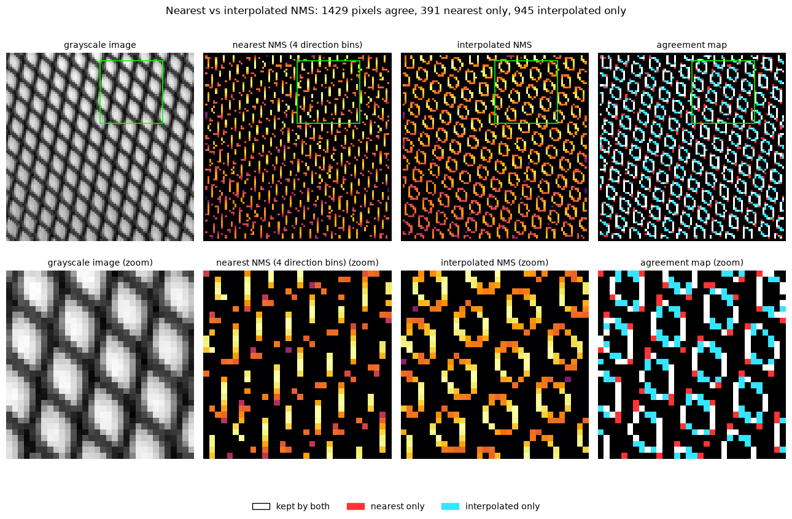

If we look at the histogram of the magnitudes (figure below) of the positive responses we see again that the interpolated version keeps many more of the pixels. The figure also shows another agreement map where we see that the edges missing from the nearest-direction approximation are mostly slanted edges. Interestingly it seems some edges are also present in the nearest-direction approximation which are not in the interpolated version. These are mostly also artefacts of the discrete approximation. 

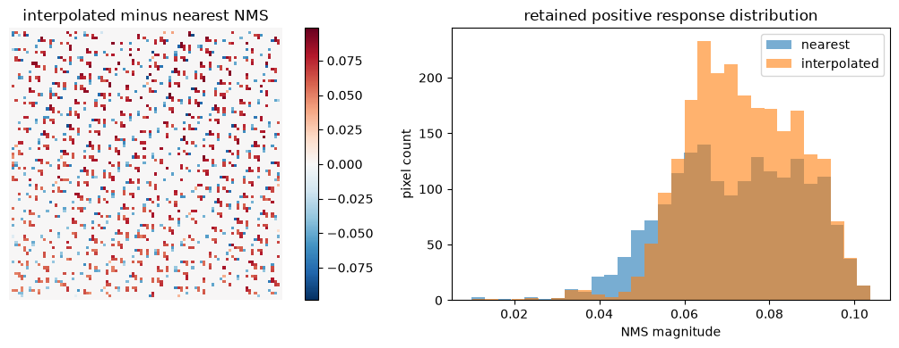

**4 vs 8 connectivity**

Connectivity has an impact on what edges are kept in the final edge map. 4 connectivity tends to keep less edges, loosing or breaking up slanted edges especially as they tend to be connected via diagonal pixels. The figure below shows this on an example on an image of wood where there are many slanted edges. We notive that the 4-connectivity fails to capture a lot of these slanted edges and focuses only on the mostly vertical ones.

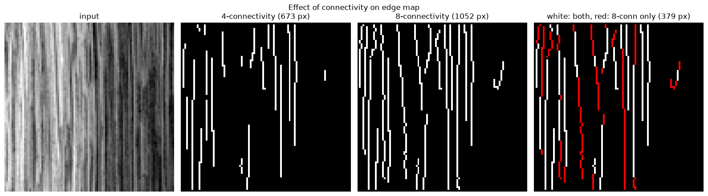

## Features and Representations

In this section we aim to build features from our images in order to be able to train a classification model to determine texture class. To do this we want to transform our images into features vectors that we can feed into a classification algorithm, as feading raw pixel values to these simple algorithm is unlikely to yeild good results. Unlike in deep learning where the features are automatically determined via backpropagation through a convolutional neural network module, we build these features manually using the tools built in previous sections.

We implement the `extract_local_features` function, which constructs a dense feature map ($H \times W \times D$) by combining up to four feature families according to a `FeatureConfig` instance:

1. **Input Normalization & Preprocessing:** Converts the input image to a float32 array normalized to $[0, 1]$, ensures 3-channel RGB alignment, and generates a grayscale image for downstream filter operations.
2. **Colour Features:** Raw $R, G, B$ color channels extracted directly from the image.
3. **Gabor Features:** Spatial energy maps computed across a multi-frequency and multi-orientation Gabor filter bank with spatial pooling.
4. **Gradient Energy Features:** Mean-pooled squared gradient magnitudes computed using a local box filter of size `density_size`.
5. **Edge Features:** Global binary edge density computed via spatial box filtering, along with $N$ orientation-binned edge density maps mapped across $[0, \pi)$.

Each feature family can be toggled via the configuration object. Enabled features are concatenated along the feature dimension to form an $H \times W \times D$ map alongside a list of $D$ channel name strings. Optionally, per-channel z-score standardization (zero mean, unit variance) is applied spatially across the feature map.

To collapse the dense local feature map into a single global representation for downstream classification or retrieval, `global_pool` aggregates spatial details across the entire image into summary statistics. By flattening the spatial dimensions into pixel-wise feature vectors and computing statistics like mean, standard deviation, and key percentiles (e.g., 90th percentile) per channel, it creates a fixed-size vector that captures both the average presence and the extreme activations of features across the image. This makes the final descriptor invariant to image size and spatial translation of features, as global pooling aggregates statistics across all spatial locations regardless of where a feature occurs. However, the descriptor is not invariant to rotation. Rotating the image alters edge orientations and directional textures, activating different Gabor filter channels and edge orientation bins. For example, rotating a wood grain texture changes its dominant edge angles, resulting in a distinct descriptor vector.

Thus, in our final feature vector is a concatenation of summary statistics for each feature channel : 

$$
\mathbf{x} = \big[\;
\underbrace{\text{mean}(\text{colour}), \dots, \text{mean}(\text{edge})}_{\text{mean of each channel}},\;
\underbrace{\text{std}(\text{colour}), \dots, \text{std}(\text{edge})}_{\text{std of each channel}},\;
\underbrace{\text{p90}(\text{colour}), \dots, \text{p90}(\text{edge})}_{\text{90th percentile of each channel}}
\;\big]
$$

### Question 3 : Why is standardising the features important ?

The figure below shows the scale disparities across feature families: while Colour (RGB) features have both a high mean and high variance because of uncentered pixel intensities over a wide dynamic range, Edge features keep a low overall mean with high variance due to sparse boundary spikes, and Gabor features stay low in both mean and variance from zero-mean filtering and spatial pooling. Left unstandardized, these scale differences allow high-magnitude or high-variance features to dominate distance metrics and gradient updates, while causing regularization to penalize model weights unevenly. Standardizing all features to zero mean and unit variance ensures every feature family contributes equitably, making the optimization landscape much better suited for downstream classification.

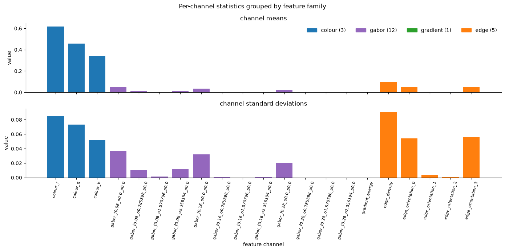

### Classification using Logistic Regression

Once we have constructed our features, we can now train a classification model to determine the texture class of each image. 

First we load our train (20 samples, 4 per material), validation (100 samples, 10 good and 10 deffective per material) and test data (99 samples, 10 good and 10 deffective per material, except wood that only has 9 examples with no defects).
We can visualise the two first principale components of our features in order to get a bit of intuition on the linear seperability of the data. The figure below shows a PCA on all of the data, this is only for analysis : our model will only be fitted on training data and hyperparameters will be chosen on validation data, test data stays held-out.

**Note :** The "wood" class seems to be missing a sample in the test set and only counts 9 non defectuous samples instead of 10. This souldn't change the analysis too drastically but is important to note.

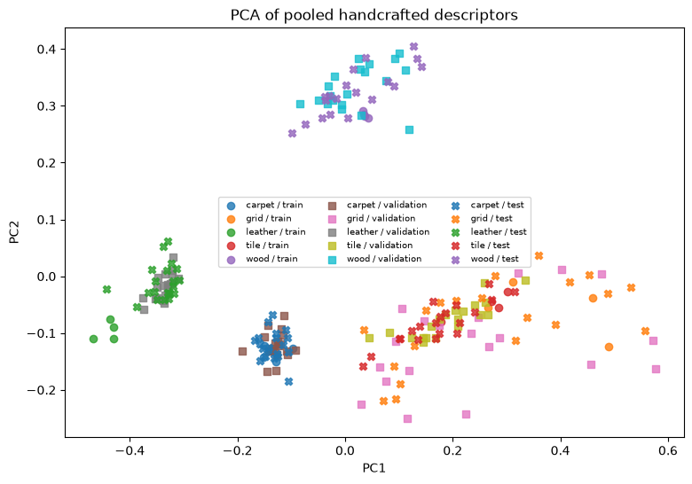

To fit our data, we use the supplied `fit_material_classifier` function which builds a pipeline that scales the data using `StandardScaler` and fits a multiclass logistic regression. 

As metrics we use accuracy and macro F1 (detailed later).

## Normality Model

## Results and Analysis Task A-C

### Task A results : material classifier

Accuracy is the fraction of images whose predicted material matches the true material:

$$
\text{Accuracy} = \frac{1}{N}\sum_{i=1}^{N} \mathbb{1}\left[\hat{y}_i = y_i\right] = \frac{\sum_{c=1}^{C} TP_c}{N}
$$

where $N$ is the number of images, $C = 5$ is the number of material classes, $y_i$ and $\hat{y}_i$ are the true and predicted labels, and $TP_c$ is the number of correctly classified images of class $c$.

Macro F1 is the unweighted mean of the per-class F1 scores, so each material counts equally regardless of its number of images:

$$
\text{Precision}_c = \frac{TP_c}{TP_c + FP_c}, \qquad
\text{Recall}_c = \frac{TP_c}{TP_c + FN_c}
$$

$$
F1_c = \frac{2\,\text{Precision}_c\,\text{Recall}_c}{\text{Precision}_c + \text{Recall}_c}, \qquad
\text{Macro-F1} = \frac{1}{C}\sum_{c=1}^{C} F1_c
$$

where $FP_c$ and $FN_c$ are the false positives and false negatives of class $c$.

We report the following accuracy and macro F1 scores :

| Subset | Images | Accuracy | Macro-F1 |
|:---:|:---:|:---:|:---:|
| **Overall** | **99** | **0.9495** | **0.9492** |
| **Normal** | **49** | **0.9184** | **0.9136** |
| **Defective** | **50** | **0.9800** | **0.9799** |

To further investigate these scores we can look at the confusion matrix where each cell $C_{i,j}$ is the number of examples of the $i$-th class predicted as $j$-th class (the diagonal are the correct predictions). The figure below shows this confusion matrix. We notice a total of 5 misclassifications : 2 grid predicted as carpet, 2 grid predicted as tile, 1 leather predicted as carpet. It would seem that the grid is the class that is the most misclassified.

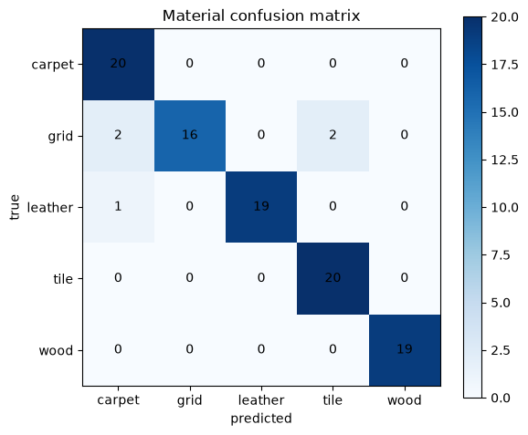

Below we show the confidence histogram (left) and the reliability diagram (right). The confidence histogram shows that the model is generally confident, with most predictions falling in the 0.8 to 1.0 bins. The reliability plot shows the alignement between the models mean confidence its predictions of a class and the actual accuracy it has on that class. A perfectly calibrated model would have all points on the diagonal of this plot. Most points are in the upper right (good confidence and accurate predictions), with a few under the diagonal (overconfident) and some over the diagonnal (underconfident). 

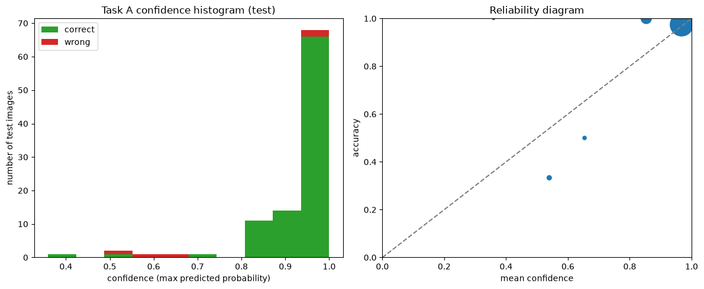

Let's analyse two of the errors more closely to try and understand why they happened. 

**Error 1 : Grid predicted as carpet**

In this first mistake the model classifies a grid example as a carpet example with very high confidence (94 %).

To understand which features influenced this prediction most heavily, we look at which features contribute most to the difference between the score for the true class and the score for the predicted class.

Recall what our feature vector looks like. Each pixel gets a vector of local channels (colour, Gabor energies, gradient energy, edge densities). Each channel is then summarised over the whole image by a few pooling statistics, and these summaries are concatenated into a single descriptor:

\[
\mathbf{x} = \big[\;
\underbrace{\text{mean}(\text{colour}), \dots, \text{mean}(\text{edge})}_{\text{mean of each channel}},\;
\underbrace{\text{std}(\text{colour}), \dots, \text{std}(\text{edge})}_{\text{std of each channel}},\;
\underbrace{\text{p90}(\text{colour}), \dots, \text{p90}(\text{edge})}_{\text{90th percentile of each channel}}
\;\big]
\]

So every entry of $\mathbf{x}$ is one summary statistic of one feature channel.

For a logistic regression classifier, the score (logit) of class $k$ for an image with standardized descriptor $\mathbf{z}$ is $s_k = \mathbf{w}_k^\top \mathbf{z} + b_k$, and the predicted class is the one with the highest score. The gap between the predicted class $p$ (tile) and the true class $t$ (grid) is therefore

$$
s_p - s_t = \sum_{j} \underbrace{(w_{p,j} - w_{t,j})\, z_j}_{c_j} \; + \; (b_p - b_t),
$$

where $c_j$ is the contribution of descriptor entry $j$ to the error. Each channel is summarised by several pooled statistics (mean, std, p90), so we add the contributions of all statistics belonging to the same channel $d$:

$$
C_d = \sum_{s \in \{\text{mean},\,\text{std},\,\text{p90}\}} (w_{p,(s,d)} - w_{t,(s,d)})\, z_{(s,d)}.
$$

A positive $C_d$ means channel $d$ pushed the image towards the wrong class (tile), and a negative $C_d$ means it pushed towards the true class (grid). The family-level bars are obtained by summing $C_d$ over all channels in the same feature family. [AI-DESIGN][AI-TEXT][HUMAN-CHECK]

The figure below shows these values for this first misclassification. We see that the biggest causes of the misclassification are as follows : 

- Edge density per orientation : edges at different orientations, especially orientation 1 which are slightly tilted edges
- Vertical gabor features or different frequencies, in particular frequency 0.22
- Global edge density

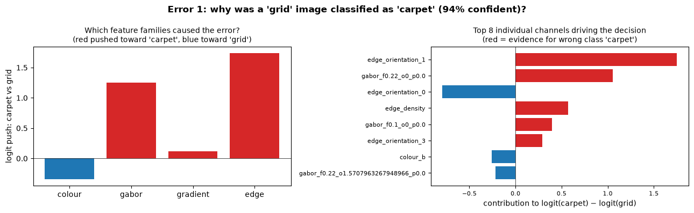

We can now compare the most impactful feature maps of the misclassified example with the feature maps of the nearest well-classified examples of both the misattributed class (carpet) and the true class (grid). Because the logistic regression classifier operates on channel-wise summary statistics (such as mean, std, and p90), its prediction depends directly on the overall activation magnitudes in feature space.

The most striking visual difference is in the vertical Gabor filter (`#2: gabor_f0.22_o0_p0.0`). It responds strongly across the correctly classified grid example, but shows very little activation for both the misclassified grid and the correctly classified carpet example. This loss of vertical response removes strong evidence for the "grid" class. At the same time, edge features—specifically `#1: edge_orientation_1` and `#3: edge_density`—show visibly stronger activations on the misclassified grid and carpet than on the correctly classified grid, yielding higher summary values that push the prediction toward "carpet".

We hypothesize that the main cause of this misclassification is the **rotation** of the grid. Because Gabor filters and orientation-specific edge features are not invariant to in-plane rotations, rotating the grid alters which channels trigger, depressing the vertical Gabor response while inflating non-target edge channels.

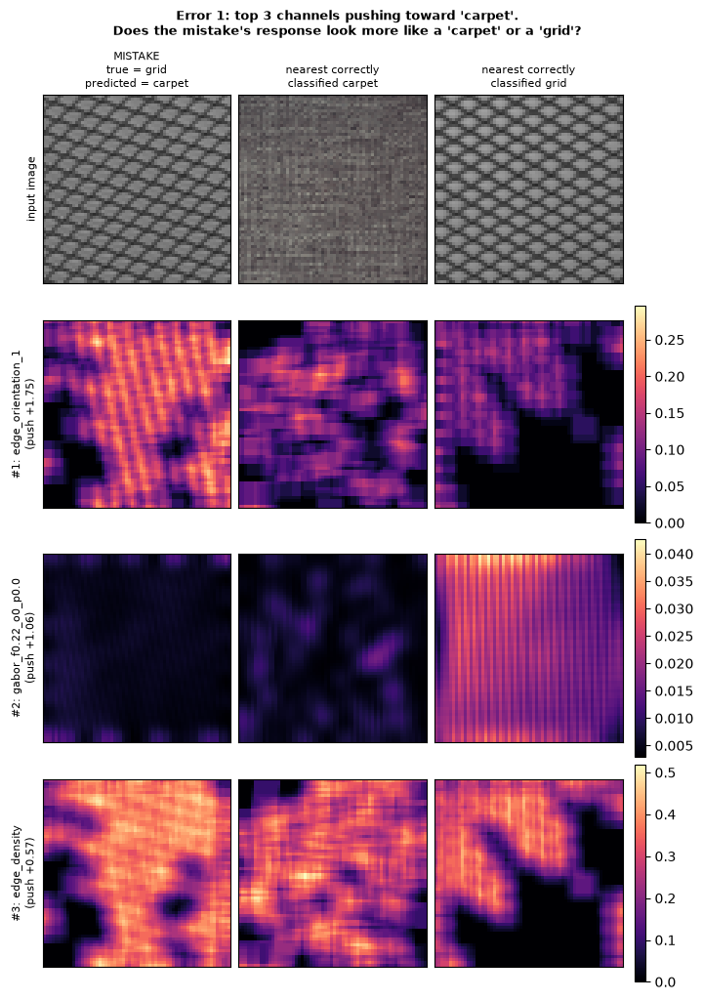

**Error 2  (Grid predicted as tile)**

We compute the same figures for another mistake where the model predicted a grid example as a tile. This time the model is not as confident (only 52%) however the predicted probability for the correct class (grid) is close to 0 so this is still an interesting case.

The figure below shows that in this case it is the edge features (global edge density and densities in orientations 2 and 3) that are mainly contributing to this misclassification.

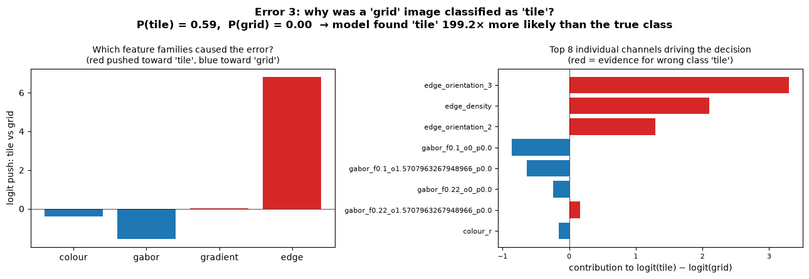

In the figure below we can see that the results are not as clear cut as in the previous error and it is difficult to understand why this was a mistake, especially considering the similarity of the images with the correctly classified grid. However, we can still se that the edge channels are seeing much stronger activation in the mistake example than on the correctly classified one, which brings it closer to a tile prediction.

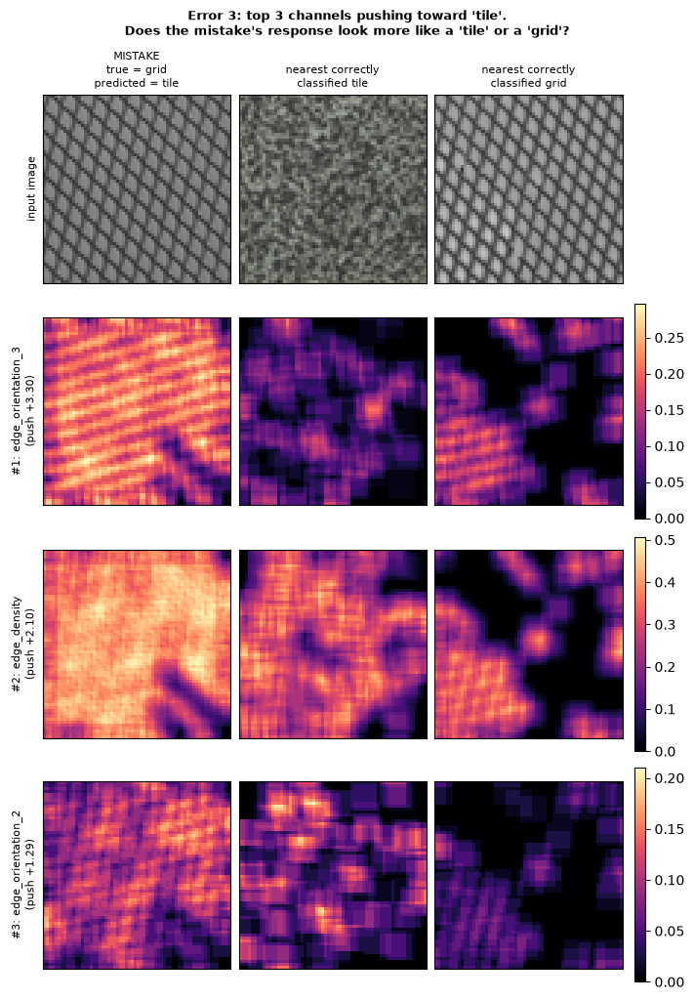

### Question 4 : Does the model do worse on defective images ?

The plot below shows accuracy on normal versus on defective images for each material class. The impact of defects seem to be minimal, with some some classes suprisignly actually seeing better performance on the examples with defects. Though these results are only computed on a very small amount of data they have to be taken with a grain of salt.

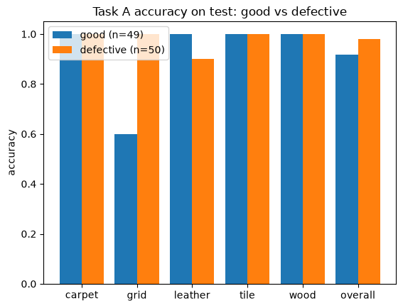

Nevertheless, the model does seem to be slightly less accurate on the leather class due to a single error that we can investigate.

## Results and Analysis Task D

## Results and Analysis Custom Photos

## AI-use disclosure table
[AI-CODE] [AI-DESIGN] [HUMAN-CHECK]
